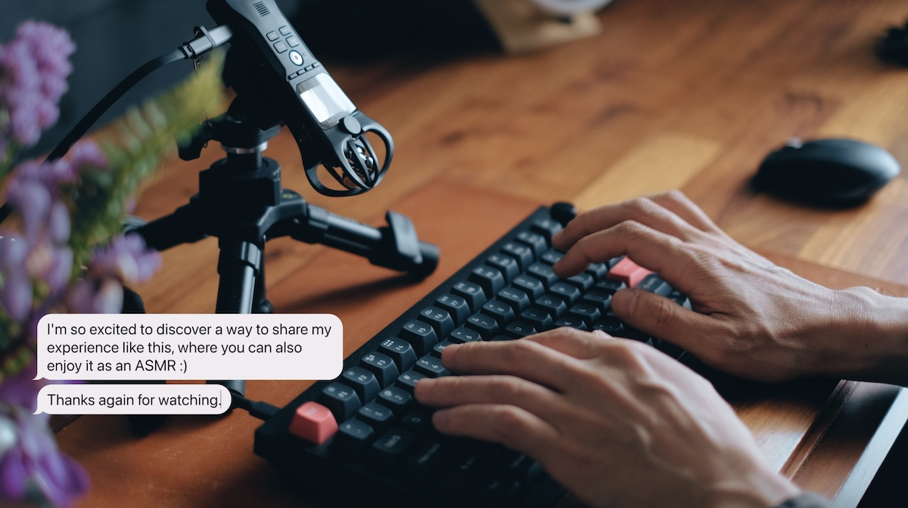

# Chat bubble tool for YouTube

A tool for recording typing animations and sounds with imitated chat UI.

- LIVE: [chat-bubbles.islomurodov.uz](https://chat-bubbles.islomurodov.uz)
- [Video tutorial](https://youtu.be/zu_vqAWHy_E)

Customisable bubble colour by [rackodo](https://github.com/rackodo).

Clone from: [rackodo/chat-bubbles-for-yt](https://github.com/rackodo/chat-bubbles-for-yt)

## issue

For firefox user need to disable that, to able to type

I don't know the really reason is, maybe about privacy stuff

work best on chromium base btw, you can download the min browser for minimal ui

## TO-DO

- [x] feat: add keyboard sound option (cuz not all users have great sound keyboard and mic)
      -> Solution: https://github.com/hainguyents13/mechvibes
